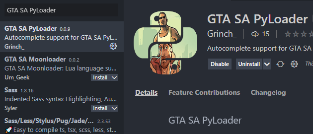

# VS Code Extension

There's a snippet extension for VS Code [here](https://marketplace.visualstudio.com/items?itemName=Grinch.sa-pyloader). It provides autocompletion for the PyLoader APIs.

### Installation:

1. Install VS Code from [here](https://code.visualstudio.com/)
2. Open up the editor, go to the extension marketplace and install the extension.

